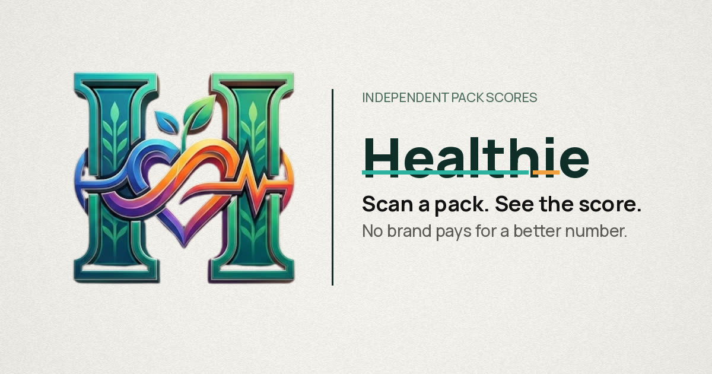
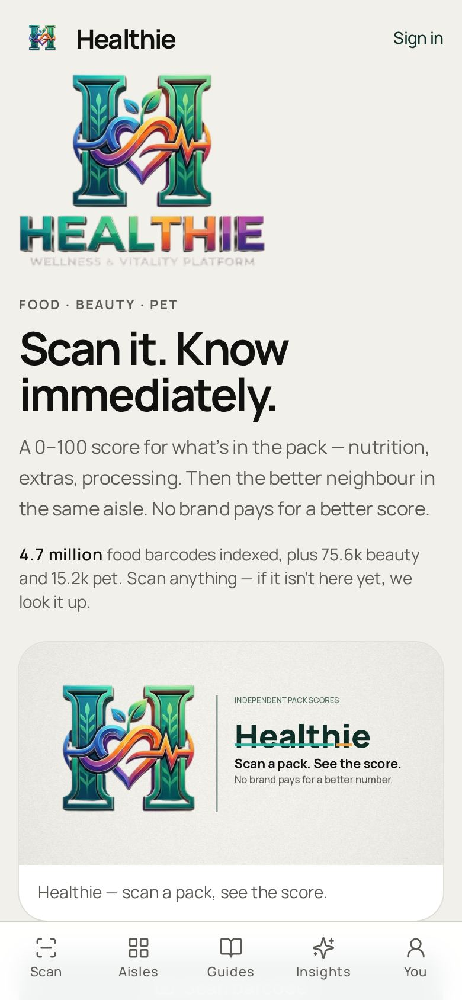
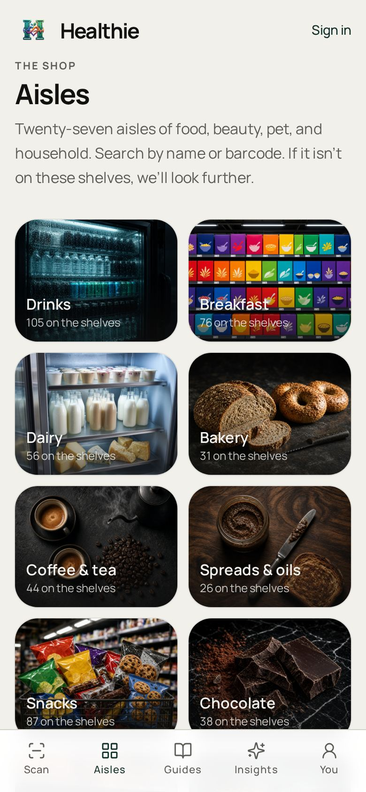
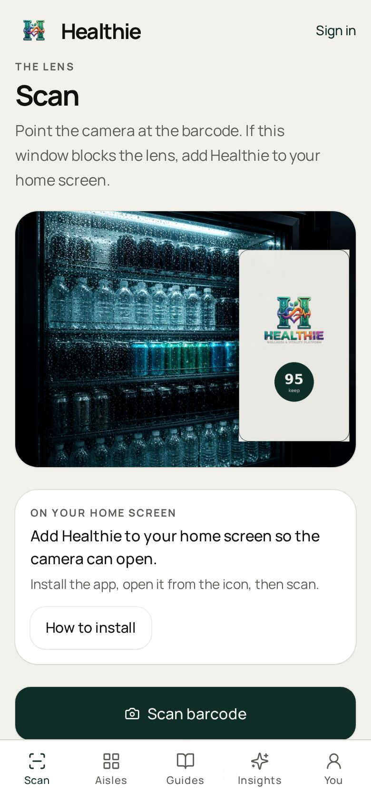
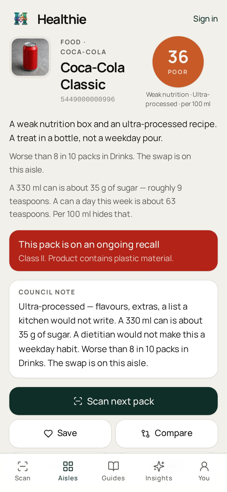
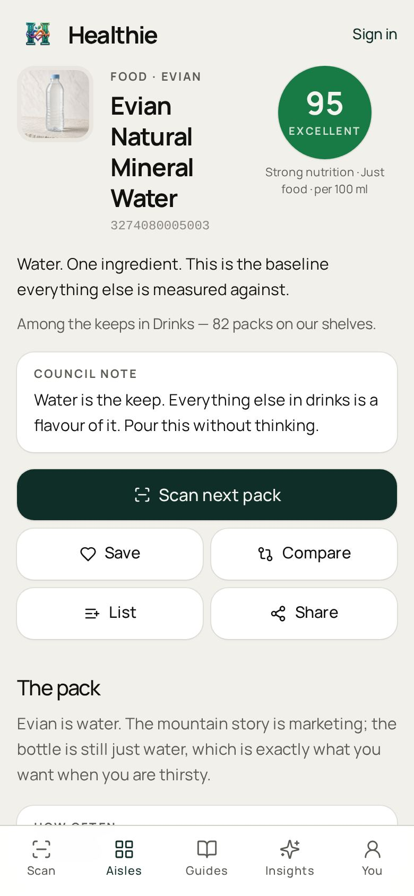
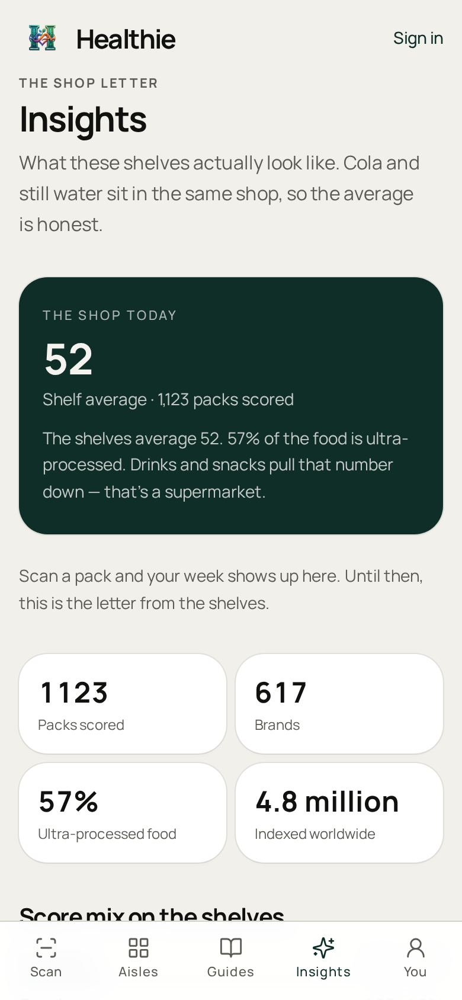
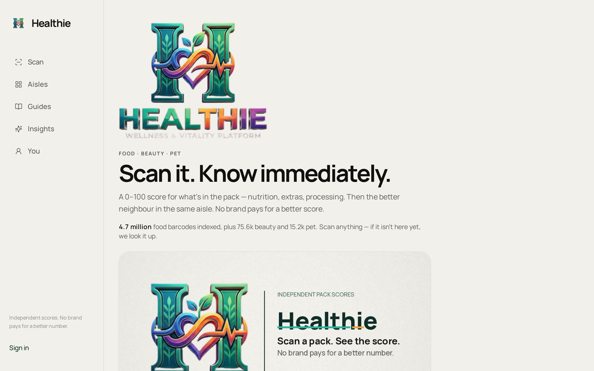

<p align="center">
  
</p>

<h1 align="center">Healthie</h1>

<p align="center">
  <strong>Scan a pack. Know immediately.</strong><br />
  Independent 0–100 scores for food, body & beauty, and pet food.<br />
  No brand pays for a better number.
</p>

<p align="center">
  
</p>

Healthie is a reading aid you can use at the shelf. Point at a barcode or photograph the front. You get a number you can say out loud, the teaspoons of sugar, the extras worth watching, and a better neighbour in the same aisle.

Not a diagnosis. Not Yuka with a new coat. Not Open Food Facts dumped on a phone. Private house — Digital Currensy Inc.

---

## The shop

<p align="center">
  
  
  
</p>

<p align="center">
  
  
  
</p>

Desktop walk:

<p align="center">
  
</p>

Try without a camera: Coca-Cola `5449000000996`, Evian `3274080005003`, Nutella `3017620422003`.

---

## The number

| Score | Word | Meaning |
| --- | --- | --- |
| 75–100 | Excellent | A keep. Short list, honest recipe. |
| 50–74 | Good | Fine sometimes. Not the best in the aisle. |
| 25–49 | Poor | A treat at best. Look one shelf over. |
| 0–24 | Avoid | Hard pass for a regular shop. |

Sugars in teaspoons. Salt in a day’s worth. Additives by name. Beauty and pet use the same ring.

**Honesty lock:** ultra-processed cannot be Good. A missing salt line is not zero. The Nutri-Score letter is not the headline — the 0–100 disc is.

---

## What’s live

| Desk | Path | What it does |
| --- | --- | --- |
| Home | `/` | Scan, search, shelves |
| Scan | `/scan` | Live lens, photograph, type, samples |
| Product | `/product/:barcode` | Score, why, extras, swaps, share |
| Aisles | `/catalog` | Food, body & beauty, pet |
| Guides | `/guides` | Sugar, NOVA, sun, pregnancy, pet bowl |
| Insights | `/insights` | The shop letter |
| You | `/you` | Lists, saved, history, sign-in |

---

## How this is different

1. **Independent** — no brand pays for a better number.
2. **Digestible** — a sentence at the shelf, not a lab dump.
3. **Three aisles, one voice** — cola, cream, and kibble share the disc.
4. **Scan that finishes** — live lens on a real phone; photograph / type when a preview cannot hold a camera.
5. **A reading aid** — never a medical claim.

---

## Docs

| File | What’s in it |
| --- | --- |
| [DESCRIPTION.md](DESCRIPTION.md) | Store / press / GitHub about |
| [ROADMAP.md](ROADMAP.md) | Now / next / later |
| [docs/MESSAGING.md](docs/MESSAGING.md) | Voice, words we refuse |
| [docs/BRAND.md](docs/BRAND.md) | Lockup, cream paper |
| [docs/CAMERA.md](docs/CAMERA.md) | Lens permissions, iframe lock |
| [docs/OG.md](docs/OG.md) | Open Graph, iMessage, validators |
| [docs/LOOPS.md](docs/LOOPS.md) | E2E loops this build earned |
| [docs/GTM.md](docs/GTM.md) | Live demo on a phone |
| [BUILT-VS-NOT.md](BUILT-VS-NOT.md) | Honest inventory |

---

## Run it

```bash
npm install
npm run dev
```

Open the app, type a barcode, or tap a sample pack.

```bash
npm test
npm run og:check
npm run typecheck
npm run build
```

Camera needs a **secure context** (HTTPS or localhost) and a **top-level** page. An embedded preview often cannot hold a live lens. Photograph the pack and type-the-numbers are the product there — not a fake camera.

---

## Architecture

- TanStack Start, React 19, Vite, TypeScript, Tailwind v4
- Scores — `src/lib/scoring` (0–100, Nutri-Score 2023 tables, NOVA cap)
- Scan — `src/lib/scan` (ZXing-WASM, `BarcodeDetector`, GS1 check digit + Digital Link)
- Catalog — Open Food Facts / Open Beauty Facts / Open Pet Food Facts + local shelves
- Share — `src/lib/og/site.json` + injector in `scripts/grok-pwa-shared.mjs`
- Auth — Better Auth, optional
- PWA — `public/manifest.webmanifest`

---

## License

Proprietary. All rights reserved. Digital Currensy Inc. See [LICENSE](LICENSE).
